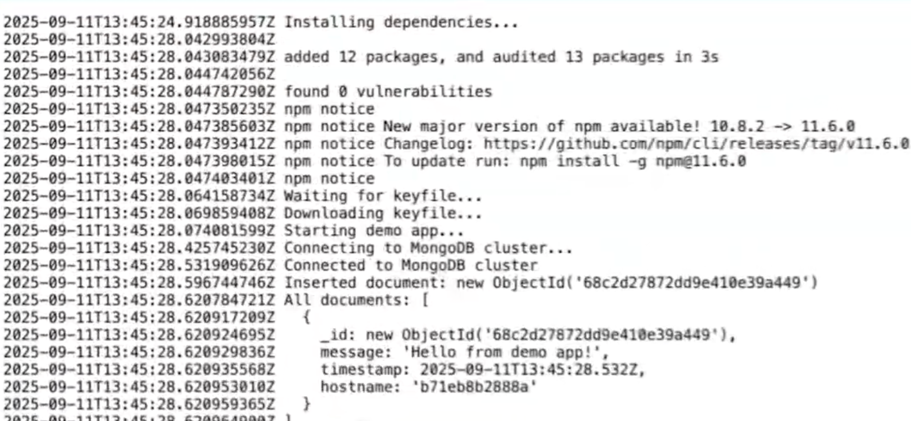

# Mongo Cluster Demo

Spin up a MongoDB replica set inside a DStack VPC using the Phala Cloud CLI.

## Prerequisites

- Phala Cloud account at <https://cloud.phala.network/>
- Phala Cloud CLI installed:

  ```bash
  npm install -g phala
  ```

- Personal access token from <https://cloud.phala.network/dashboard/tokens>

## Deployment Steps

1. Sign in with the CLI:

   ```bash
   phala auth login
   ```

2. Deploy the MongoDB cluster (run inside this directory):

   ```bash
   node deploy.js cluster
   ```

3. Watch cluster health until every node is ready:

   ```bash
   node deploy.js status --watch
   ```
   

4. Deploy the sample application that talks to the cluster:

   ```bash
   node deploy.js app
   ```

5. Open <https://cloud.phala.network/dashboard> and check the application logs to confirm it can connect to the mongo cluster. You should see entries similar to:

    


