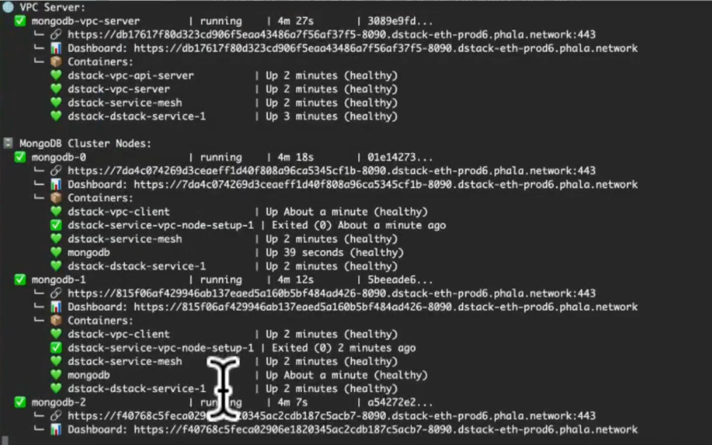
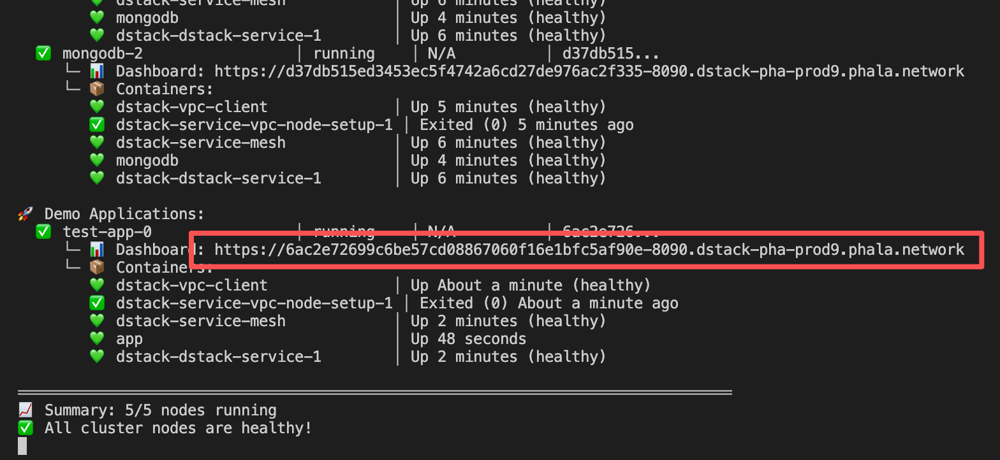
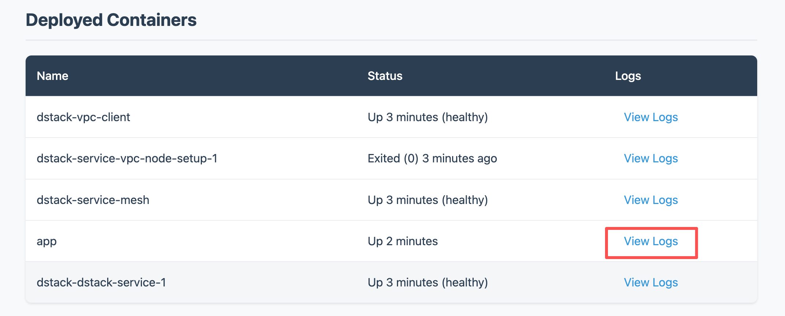

# Mongo Cluster Demo

Spin up a MongoDB replica set inside a DStack VPC using the Phala Cloud CLI.

## Prerequisites

- Phala Cloud account at <https://cloud.phala.network/>
- Nodejs v20 (Tested with v20.19.5, other versions may work)
- Phala Cloud CLI installed:

  ```bash
  npm install -g phala
  ```

- Personal access token from <https://cloud.phala.network/dashboard/tokens>

## Deployment Steps

1. Sign in with the CLI:

   ```bash
   phala auth login
   ```

2. Deploy the MongoDB cluster (run inside this directory):

   ```bash
   node deploy.js cluster
   ```

   It will generate a config file if it doesn't exist. You can optionally edit the config file or keep it as is, then run the command again.

3. Watch cluster health until every node is ready:

   ```bash
   node deploy.js status --watch
   ```
   

4. Deploy the sample application that talks to the cluster:

   ```bash
   node deploy.js app
   ```

5. Watch the nodes status again, until the demo app is ready:

   ```bash
   node deploy.js status --watch
   ```

   

5. Open the dashboard link and check the application logs to confirm it can connect to the mongo cluster. You should see entries similar to:

   

   Logs:

    ```
      2025-10-30T10:34:38.533430185Z Waiting for keyfile...
      2025-10-30T10:34:38.538363129Z Downloading keyfile...
      2025-10-30T10:34:38.541317188Z Starting demo app...
      2025-10-30T10:34:38.931292780Z Connecting to MongoDB cluster...
      2025-10-30T10:34:39.032851272Z Connected to MongoDB cluster
      2025-10-30T10:34:39.106136179Z Inserted document: new ObjectId('69033f3f26cdb527ae41a21e')
      2025-10-30T10:34:39.114648425Z All documents: [
      2025-10-30T10:34:39.114682349Z   {
      2025-10-30T10:34:39.114691041Z     _id: new ObjectId('69033f3f26cdb527ae41a21e'),
      2025-10-30T10:34:39.114698762Z     message: 'Hello from demo app!',
      2025-10-30T10:34:39.114705443Z     timestamp: 2025-10-30T10:34:39.034Z,
      2025-10-30T10:34:39.114723429Z     hostname: '660e31183cdc'
      2025-10-30T10:34:39.114730492Z   }
      2025-10-30T10:34:39.114736729Z ]
      2025-10-30T10:35:09.143306297Z Periodic insert: new ObjectId('69033f5d26cdb527ae41a21f')
      2025-10-30T10:35:39.132839598Z Periodic insert: new ObjectId('69033f7b26cdb527ae41a220')
   ```


